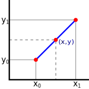

# 🧮 Matrix

---

## 🛠️ Guía de Uso del Entorno

Este proyecto utiliza un entorno automatizado gestionado con **`uv`** para garantizar una instalación ultrarrápida de las dependencias y una ejecución robusta de las pruebas en cualquier sistema (WSL, Linux 42, etc.).

### 1. Script MASTER: `setup.sh`
El archivo `setup.sh` detecta automáticamente tu sistema operativo, inicializa el entorno de forma eficiente mediante `uv` e instala las dependencias de desarrollo necesarias.

| Comando | Descripción |
| :--- | :--- |
| **`bash setup.sh test`** | **(Opción por defecto)** Crea/limpia el entorno, instala dependencias con `uv` y ejecuta **todos** los tests de la carpeta `tests/` en orden. |
| **`bash setup.sh test 00`** | Filtra la automatización para ejecutar únicamente las pruebas del Ejercicio 00. |
| **`bash setup.sh venv`** | Configura el entorno y abre una terminal interactiva con el entorno virtual activo y el `PYTHONPATH` listo para reconocer la carpeta `src/`. |
| **`bash setup.sh clean`** | Borra el entorno virtual `.matrix_venv` y limpia recursivamente los archivos de caché `__pycache__`. |

### 2. Ejecución Individual de Tests
Si deseas ejecutar las pruebas de un solo ejercicio de forma aislada con el entorno virtual previamente activado (utilizando `setup.sh venv`), puedes invocar el archivo de pruebas directamente:

```bash
python3 tests/test_ex00.py
```

### 3. Ejecución Manual del Código

Si quieres verificar el comportamiento algebraico de las estructuras de forma interactiva, primero asegúrate de abrir Python con las rutas configuradas. Puedes hacerlo de dos formas:
1. Ejecutando `bash setup.sh venv` para abrir una terminal con el entorno cargado y luego escribiendo `python3`.
2. Escribiendo `python3` directamente en la pausa interactiva de los tests automatizados.

Una vez dentro de la consola de Python (`>>>`), puedes operar tus clases de la siguiente manera:

```python
from vector import Vector
from matrix import Matrix

# Ejemplo de suma in-place con Vectores
u = Vector([2.0, 3.0])
v = Vector([5.0, 7.0])
u.add(v)
print(u)
# [7.0]
# [10.0]
```

---

## ⚡ Guía Rápida de Componentes y Restricciones

Tabla de referencia con el comportamiento algebraico y operacional de las estructuras de la librería:

| Estructura | Representación Operativa | Restricción Dimensional | Efecto Matemático / Lógico |
| --- | --- | --- | --- |
| **Vector** | Arreglo unidimensional (`list`) | Longitud idéntica para `add` / `sub` | Modificación coordenada a coordenada (*in-place*). |
| **Matrix** | Arreglo bidimensional (`list[list]`) | Mismo `shape` (filas $\times$ columnas) | Modificación elemento a elemento (*in-place*). |
| **Escalar** | Número flotante (`float`) o Complejo | Universal (aplica a cualquier dimensión) | Escala la magnitud homogéneamente (*distributivo*). |

---

## 📖 Documentación

[Essence of linear algrebra](https://www.youtube.com/playlist?list=PLZHQObOWTQDPD3MizzM2xVFitgF8hE_ab)

---
---

## EX00 - Add, Subtract and Scale

### 💡 Descripción

Este ejercicio establece las operaciones elementales fundamentales de nuestro espacio vectorial. El objetivo es implementar los mecanismos para sumar, restar y escalar vectores y matrices. De acuerdo con las especificaciones técnicas del módulo, todas las transformaciones se deben realizar **in-place** (mutando internamente la instancia que invoca el método), minimizando la sobrecarga en memoria.

### 🧠 Lógica

Para garantizar la consistencia matemática antes de proceder con cualquier mutación interna, el sistema aplica validaciones estructurales estrictas:

1. **La Suma Parcial y Resta (`add` / `sub`)**:
La operación se realiza elemento a elemento en la misma posición de la cuadrícula o arreglo.
* En **Vectores**: Se verifica que `len(self.data) == len(v.data)`.
* En **Matrices**: Se verifica que las tuplas de dimensiones `shape` sean idénticas tanto en número de filas como de columnas.
* Si las dimensiones difieren, la operación carece de sentido algebraico, por lo que se interrumpe lanzando un error de valor (`ValueError`).


2. **El Escalado Homogéneo (`scl`)**:
La operación multiplica cada componente del contenedor por un factor numérico escalar común $\alpha$. Al tratarse de una transformación lineal pura, altera la magnitud del objeto conservando intacta su geometría y proporciones dimensionales originales.

### 📊 Ejemplo de Flujo de Datos (In-place)

En cada llamada, la instancia que ejecuta el método absorbe los cambios directamente en sus arreglos internos.

#### Operación en Vectores: `u.add(v)`

```text
Vector Inicial (u):      [2.0, 3.0]
Vector Entrada (v):      [5.0, 7.0]
---------------------------------------
Estado Final (u.data):   [7.0, 10.0]   
```

#### Operación en Matrices: `m1.scl(a)`

```text
Matriz Inicial (m1):     [[1.0, 2.0], [3.0, 4.0]]
Factor Escalar (a):      2.0
-------------------------------------------------
Estado Final (m1.data):  [[2.0, 4.0], [6.0, 8.0]] 
```

---
---

## EX01 - Linear Combination

### 💡 Descripción
Una combinación lineal es la expresión matemática construida al multiplicar un conjunto de vectores por escalares y sumar los resultados. Este concepto es el núcleo absoluto del álgebra lineal y la base sobre la que se construyen las multiplicaciones de matrices y las transformaciones geométricas espaciales.

En este ejercicio se debe construir una función pura (que no modifica el estado original, sino que devuelve un nuevo `Vector`) para calcular la combinación lineal de un arreglo de vectores con sus respectivos coeficientes.


### 🧠 Lógica y Optimización (FMA)
La función implementa verificaciones de consistencia dimensional $O(n)$ en tiempo y espacio.

A nivel de arquitectura de CPU, la operación matemática `(A * B) + C` ocurre con tanta frecuencia en cálculo matricial y gráficos que los procesadores modernos tienen una instrucción ensambladora dedicada para ejecutar ambas acciones en un único flop (ciclo de reloj). Esto se conoce como **Fused Multiply-Accumulate (FMA)**. 

El uso de FMA no solo duplica teóricamente el rendimiento al reducir los pasos, sino que evita errores de redondeo de punto flotante al realizar la suma con precisión infinita internamente antes de truncar el resultado. Este proyecto detecta y utiliza nativamente `math.fma` aprovechando las bondades integradas en Python 3.13.

### 📊 Ejemplo de Flujo de Datos

```text
Vectores de entrada: V1 = [1.0, 2.0, 3.0]
                     V2 = [0.0, 10.0, -100.0]

Coeficientes:        C1 = 10.0
                     C2 = -2.0
-------------------------------------------------
1. Escalado (Totales Parciales):
   C1 * V1 = 10.0 * [1.0, 2.0, 3.0]      ➔  [10.0, 20.0, 30.0]
   C2 * V2 = -2.0 * [0.0, 10.0, -100.0]  ➔  [0.0, -20.0, 200.0]

2. Suma de Componentes:
   [ 10.0 + 0.0,  20.0 + (-20.0),  30.0 + 200.0 ]

Estado Final Vector:
   [10.0, 0.0, 230.0]
```

---
---

## EX02 - Linear Interpolation

### 💡 Descripción
La interpolación lineal (abreviada históricamente en software como `lerp`) es una operación matemática fundamental para crear transiciones. Genera un valor exacto a medio camino entre un punto de inicio ($A$) y un punto final ($B$) basándose en un parámetro $t$, que actúa como un porcentaje (donde $0.0$ es el 0% y $1.0$ es el 100%).

Esta operación es intensamente utilizada en renderizado 3D para transicionar colores, suavizar movimientos de cámara de un frame a otro o calcular trayectorias. El objetivo del ejercicio es construir la función `linear_interpolation` para que sea versátil y capaz de interpolar tanto números simples como colecciones enteras de números (Vectores y Matrices).



### 🧠 Lógica
La interpolación lineal funciona como un **promedio ponderado** o una balanza entre dos valores. A medida que el porcentaje $t$ avanza de $0.0$ a $1.0$, el peso o la influencia del punto inicial ($u$) disminuye, mientras que la del punto final ($v$) aumenta de forma inversamente proporcional.

La fórmula que utilizamos en el código es:
`linear_interpolation(u, v, t) = (1 - t) * u + t * v`

**¿Por qué utilizamos esta fórmula y no la clásica `u + t * (v - u)`?**
Aunque matemáticamente ambas expresiones son idénticas (significan "empieza en $u$ y suma un porcentaje de la distancia total hasta $v$"), en ciencias de la computación utilizamos la forma de "promedio ponderado" por dos razones críticas:

1. **Garantía de los Extremos:** Asegura un anclaje perfecto en los límites.
   * Cuando $t = 0.0$: la fórmula se reduce a `(1 * u) + (0 * v)`, devolviendo exactamente **$u$**.
   * Cuando $t = 1.0$: la fórmula se reduce a `(0 * u) + (1 * v)`, devolviendo exactamente **$v$**.
2. **Estabilidad de Punto Flotante (IEEE 754):** Debido a cómo los procesadores manejan los números decimales en binario, la resta `(v - u)` de la fórmula clásica puede generar pequeños errores de redondeo. Al multiplicar ese error por $t$ y sumárselo a $u$, es muy probable que cuando $t = 1.0$, el resultado final no sea exactamente $v$, dejando un "residuo" decimal indeseado. Nuestra fórmula mitigará este problema de hardware distribuyendo la multiplicación.

Para estructuras complejas como Vectores y Matrices, la función aplica la misma fórmula iterando de forma paralela (componente a componente).

### 📊 Ejemplos de Flujo de Datos

**Interpolar Escalares:**
```text
linear_interpolation(21.0, 42.0, 0.3)
-------------------------------------------------
Cálculo: (1.0 - 0.3) * 21.0 + (0.3) * 42.0
Resultado: 27.3  (Hemos avanzado el 30% de la distancia entre 21 y 42).
```

**Interpolar Vectores:**
```text
V1: [2.0,  1.0]
V2: [4.0,  2.0]
t:  0.3
-------------------------------------------------
Calculo X: linear_interpolation(2.0, 4.0, 0.3) ➔ 2.6
Calculo Y: linear_interpolation(1.0, 2.0, 0.3) ➔ 1.3
Resultado Vector: [2.6, 1.3]
```

---
---

## EX03 - Dot Product

### 💡 Descripción
El producto escalar (o *dot product*, representado a menudo como $u \cdot v$ o $\langle u|v \rangle$) es una de las operaciones más críticas del álgebra lineal. Toma dos vectores de la misma dimensión y los "comprime", devolviendo un **único número escalar** (no un vector). 

Geométricamente, el producto escalar es una medida de correlación direccional: nos indica qué tan alineados están dos vectores. Si el resultado es `0`, significa que los vectores son perfectamente perpendiculares entre sí. Es la pieza clave para calcular proyecciones ortogonales y resolver multiplicaciones matriciales.

### 🧠 Lógica y Optimización
Para calcularlo, se multiplican las componentes homólogas de ambos vectores (X con X, Y con Y, etc.) y se suman todos esos productos parciales en un único acumulador escalar.

Al igual que en combinaciones lineales, aprovechamos la instrucción nativa Fused Multiply-Add (`math.fma`) para realizar la operación de multiplicar y acumular cada componente de forma atómica a nivel de procesador, garantizando máxima velocidad y esquivando el truncamiento del error de punto flotante.

La complejidad algorítmica lograda es:
* **Tiempo: $O(n)$** ya que se recorren los $n$ elementos homólogos en un único bucle.
* **Espacio: $O(1)$** dado que el resultado es simplemente un número primitivo (`float`), evitando instanciar nuevas estructuras iterables en memoria.

### 📊 Ejemplo de Flujo de Datos

```text
Vectores: u = [4.0, 2.0]
          v = [2.0, 1.0]
-------------------------------------------------
Cálculo: (u_x * v_x) + (u_y * v_y)
Desarrollo FMA: (4.0 * 2.0) + (2.0 * 1.0)
Acumulador: 8.0 + 2.0

Resultado Escalar: 10.0
```