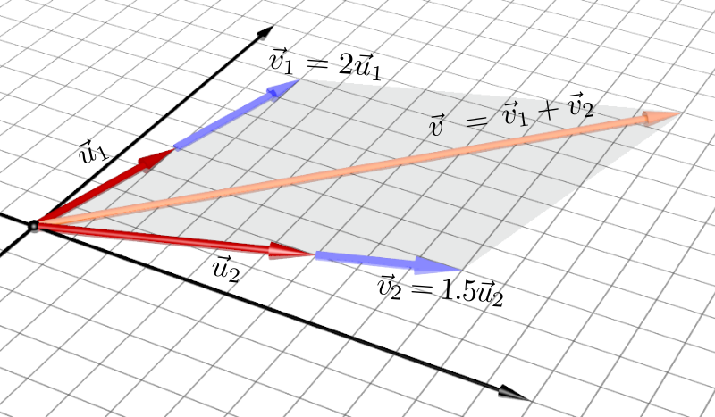
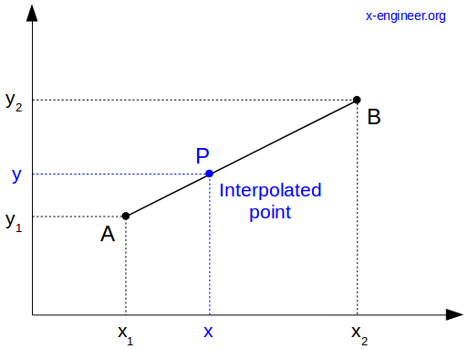
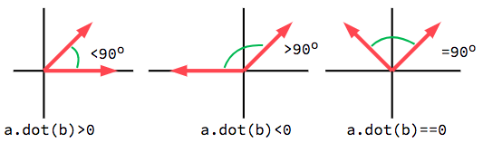
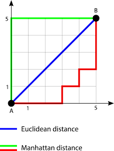
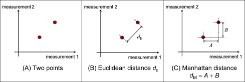
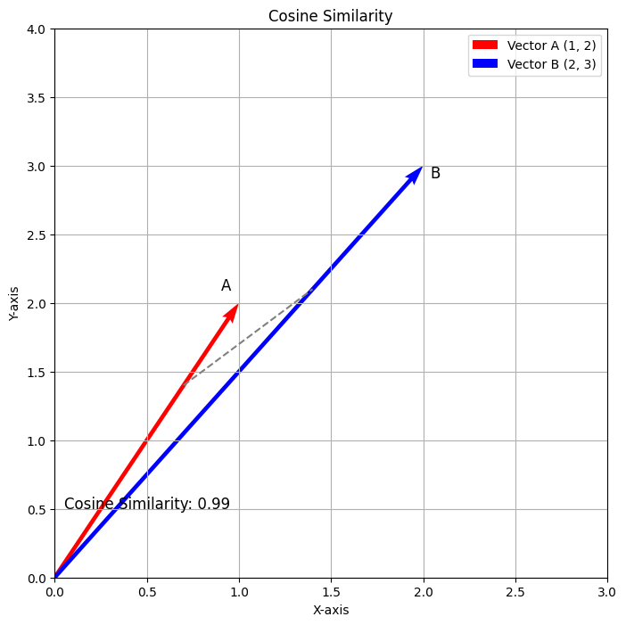
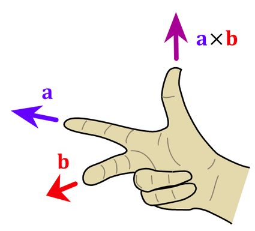
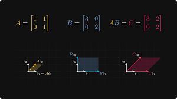

# 🧮 Matrix

---

## 🛠️ Guía de Uso del Entorno

Este proyecto utiliza un entorno automatizado gestionado con **`uv`** para garantizar una instalación ultrarrápida de las dependencias y una ejecución robusta de las pruebas en cualquier sistema (WSL, Linux 42, etc.).

### 1. Script MASTER: `setup.sh`
El archivo `setup.sh` detecta automáticamente tu sistema operativo, inicializa el entorno de forma eficiente mediante `uv` e instala las dependencias de desarrollo necesarias.

| Comando | Descripción |
| :--- | :--- |
| **`bash setup.sh test`** | **(Opción por defecto)** Crea/limpia el entorno, instala dependencias con `uv` y ejecuta **todos** los tests de la carpeta `tests/` en orden. |
| **`bash setup.sh test 00`** | Filtra la automatización para ejecutar únicamente las pruebas del Ejercicio 00. |
| **`bash setup.sh venv`** | Configura el entorno y abre una terminal interactiva con el entorno virtual activo y el `PYTHONPATH` listo para reconocer la carpeta `src/`. |
| **`bash setup.sh clean`** | Borra el entorno virtual `.matrix_venv` y limpia recursivamente los archivos de caché `__pycache__`. |

### 2. Ejecución Individual de Tests
Si deseas ejecutar las pruebas de un solo ejercicio de forma aislada con el entorno virtual previamente activado (utilizando `setup.sh venv`), puedes invocar el archivo de pruebas directamente:

```bash
python3 tests/test_ex00.py
```

### 3. Ejecución Manual del Código

Si quieres verificar el comportamiento algebraico de las estructuras de forma interactiva, primero asegúrate de abrir Python con las rutas configuradas. Puedes hacerlo de dos formas:
1. Ejecutando `bash setup.sh venv` para abrir una terminal con el entorno cargado y luego escribiendo `python3`.
2. Escribiendo `python3` directamente en la pausa interactiva de los tests automatizados.

Una vez dentro de la consola de Python (`>>>`), puedes operar tus clases de la siguiente manera:

```python
from vector import Vector
from matrix import Matrix

# Ejemplo de suma in-place con Vectores
u = Vector([2.0, 3.0])
v = Vector([5.0, 7.0])
u.add(v)
print(u)
# [7.0]
# [10.0]
```

---

## ⚡ Guía Rápida de Componentes y Restricciones

Tabla de referencia con el comportamiento algebraico y operacional de las estructuras de la librería:

| Estructura | Representación Operativa | Restricción Dimensional | Efecto Matemático / Lógico |
| --- | --- | --- | --- |
| **Vector** | Arreglo unidimensional (`list`) | Longitud idéntica para `add` / `sub` | Modificación coordenada a coordenada (*in-place*). |
| **Matrix** | Arreglo bidimensional (`list[list]`) | Mismo `shape` (filas $\times$ columnas) | Modificación elemento a elemento (*in-place*). |
| **Escalar** | Número flotante (`float`) o Complejo | Universal (aplica a cualquier dimensión) | Escala la magnitud homogéneamente (*distributivo*). |

---

## 📖 Documentación

[Essence of linear algrebra](https://www.youtube.com/playlist?list=PLZHQObOWTQDPD3MizzM2xVFitgF8hE_ab)

---
---

## EX00 - Add, Subtract and Scale

### 💡 Descripción

Este ejercicio establece las operaciones elementales fundamentales de nuestro espacio vectorial. El objetivo es implementar los mecanismos para sumar, restar y escalar vectores y matrices. De acuerdo con las especificaciones técnicas del módulo, todas las transformaciones se deben realizar **in-place** (mutando internamente la instancia que invoca el método), minimizando la sobrecarga en memoria.

### 🧠 Lógica

Para garantizar la consistencia matemática antes de proceder con cualquier mutación interna, el sistema aplica validaciones estructurales estrictas:

1. **La Suma Parcial y Resta (`add` / `sub`)**:
La operación se realiza elemento a elemento en la misma posición de la cuadrícula o arreglo.
* En **Vectores**: Se verifica que `len(self.data) == len(v.data)`.
* En **Matrices**: Se verifica que las tuplas de dimensiones `shape` sean idénticas tanto en número de filas como de columnas.
* Si las dimensiones difieren, la operación carece de sentido algebraico, por lo que se interrumpe lanzando un error de valor (`ValueError`).


2. **El Escalado Homogéneo (`scl`)**:
La operación multiplica cada componente del contenedor por un factor numérico escalar común $\alpha$. Al tratarse de una transformación lineal pura, altera la magnitud del objeto conservando intacta su geometría y proporciones dimensionales originales.

### 📊 Ejemplos

En cada llamada, la instancia que ejecuta el método absorbe los cambios directamente en sus arreglos internos.

#### Operación en Vectores: `u.add(v)`

```text
Vector Inicial (u):      [2.0, 3.0]
Vector Entrada (v):      [5.0, 7.0]
---------------------------------------
Estado Final (u.data):   [7.0, 10.0]   
```

#### Operación en Matrices: `m1.scl(a)`

```text
Matriz Inicial (m1):     [[1.0, 2.0], [3.0, 4.0]]
Factor Escalar (a):      2.0
-------------------------------------------------
Estado Final (m1.data):  [[2.0, 4.0], [6.0, 8.0]] 
```

---
---

## EX01 - Linear Combination

### 💡 Descripción
Una combinación lineal es la expresión matemática construida al multiplicar un conjunto de vectores por escalares y sumar los resultados. Este concepto es el núcleo absoluto del álgebra lineal y la base sobre la que se construyen las multiplicaciones de matrices y las transformaciones geométricas espaciales.

En este ejercicio se debe construir una función pura (que no modifica el estado original, sino que devuelve un nuevo `Vector`) para calcular la combinación lineal de un arreglo de vectores con sus respectivos coeficientes.

<p align="center">
  
</p>


### 🧠 Lógica & Optimización (FMA)
La función implementa verificaciones de consistencia dimensional $O(n)$ en tiempo y espacio.

A nivel de arquitectura de CPU, la operación matemática `(A * B) + C` ocurre con tanta frecuencia en cálculo matricial y gráficos que los procesadores modernos tienen una instrucción ensambladora dedicada para ejecutar ambas acciones en un único flop (ciclo de reloj). Esto se conoce como **Fused Multiply-Accumulate (FMA)**. 

El uso de FMA no solo duplica teóricamente el rendimiento al reducir los pasos, sino que evita errores de redondeo de punto flotante al realizar la suma con precisión infinita internamente antes de truncar el resultado. Este proyecto detecta y utiliza nativamente `math.fma` aprovechando las bondades integradas en Python 3.13.

### 📊 Ejemplo

```text
Vectores de entrada: V1 = [1.0, 2.0, 3.0]
                     V2 = [0.0, 10.0, -100.0]

Coeficientes:        C1 = 10.0
                     C2 = -2.0
-------------------------------------------------
1. Escalado (Totales Parciales):
   C1 * V1 = 10.0 * [1.0, 2.0, 3.0]      ➔  [10.0, 20.0, 30.0]
   C2 * V2 = -2.0 * [0.0, 10.0, -100.0]  ➔  [0.0, -20.0, 200.0]

2. Suma de Componentes:
   [ 10.0 + 0.0,  20.0 + (-20.0),  30.0 + 200.0 ]

Estado Final Vector:
   [10.0, 0.0, 230.0]
```

---
---

## EX02 - Linear Interpolation

### 💡 Descripción
La interpolación lineal (abreviada históricamente en software como `lerp`) es una operación matemática fundamental para crear transiciones. Genera un valor exacto a medio camino entre un punto de inicio ($A$) y un punto final ($B$) basándose en un parámetro $t$, que actúa como un porcentaje (donde $0.0$ es el 0% y $1.0$ es el 100%).

Esta operación es intensamente utilizada en renderizado 3D para transicionar colores, suavizar movimientos de cámara de un frame a otro o calcular trayectorias. El objetivo del ejercicio es construir la función `linear_interpolation` para que sea versátil y capaz de interpolar tanto números simples como colecciones enteras de números (Vectores y Matrices).

<p align="center">
  
</p>

### 🧠 Lógica
La interpolación lineal funciona como un **promedio ponderado** o una balanza entre dos valores. A medida que el porcentaje $t$ avanza de $0.0$ a $1.0$, el peso o la influencia del punto inicial ($u$) disminuye, mientras que la del punto final ($v$) aumenta de forma inversamente proporcional.

La fórmula que utilizamos en el código es:
`linear_interpolation(u, v, t) = (1 - t) * u + t * v`

**¿Por qué utilizamos esta fórmula y no la clásica `u + t * (v - u)`?**
Aunque matemáticamente ambas expresiones son idénticas (significan "empieza en $u$ y suma un porcentaje de la distancia total hasta $v$"), en ciencias de la computación utilizamos la forma de "promedio ponderado" por dos razones críticas:

1. **Garantía de los Extremos:** Asegura un anclaje perfecto en los límites.
   * Cuando $t = 0.0$: la fórmula se reduce a `(1 * u) + (0 * v)`, devolviendo exactamente **$u$**.
   * Cuando $t = 1.0$: la fórmula se reduce a `(0 * u) + (1 * v)`, devolviendo exactamente **$v$**.
2. **Estabilidad de Punto Flotante (IEEE 754):** Debido a cómo los procesadores manejan los números decimales en binario, la resta `(v - u)` de la fórmula clásica puede generar pequeños errores de redondeo. Al multiplicar ese error por $t$ y sumárselo a $u$, es muy probable que cuando $t = 1.0$, el resultado final no sea exactamente $v$, dejando un "residuo" decimal indeseado. Nuestra fórmula mitigará este problema de hardware distribuyendo la multiplicación.

Para estructuras complejas como Vectores y Matrices, la función aplica la misma fórmula iterando de forma paralela (componente a componente).

### 📊 Ejemplos

**Interpolar Escalares:**
```text
linear_interpolation(21.0, 42.0, 0.3)
-------------------------------------------------
Cálculo: (1.0 - 0.3) * 21.0 + (0.3) * 42.0
Resultado: 27.3  (Hemos avanzado el 30% de la distancia entre 21 y 42).
```

**Interpolar Vectores:**
```text
V1: [2.0,  1.0]
V2: [4.0,  2.0]
t:  0.3
-------------------------------------------------
Calculo X: linear_interpolation(2.0, 4.0, 0.3) ➔ 2.6
Calculo Y: linear_interpolation(1.0, 2.0, 0.3) ➔ 1.3
Resultado Vector: [2.6, 1.3]
```

---
---

## EX03 - Dot Product

### 💡 Descripción
El producto escalar (o *dot product*, representado a menudo como $u \cdot v$ o $\langle u|v \rangle$) es una de las operaciones más críticas del álgebra lineal. Toma dos vectores de la misma dimensión y los "comprime", devolviendo un **único número escalar** (no un vector). 

Geométricamente, el producto escalar es una medida de correlación direccional: nos indica qué tan alineados están dos vectores. Si el resultado es `0`, significa que los vectores son perfectamente perpendiculares entre sí. Es la pieza clave para calcular proyecciones ortogonales y resolver multiplicaciones matriciales.

<p align="center">
  
</p>

### 🧠 Lógica
Para calcularlo, se multiplican las componentes homólogas de ambos vectores (X con X, Y con Y, etc.) y se suman todos esos productos parciales en un único acumulador escalar.

Al igual que en combinaciones lineales, aprovechamos la instrucción nativa Fused Multiply-Add (`math.fma`) para realizar la operación de multiplicar y acumular cada componente de forma atómica a nivel de procesador, garantizando máxima velocidad y esquivando el truncamiento del error de punto flotante.

La complejidad algorítmica lograda es:
* **Tiempo: $O(n)$** ya que se recorren los $n$ elementos homólogos en un único bucle.
* **Espacio: $O(1)$** dado que el resultado es simplemente un número primitivo (`float`), evitando instanciar nuevas estructuras iterables en memoria.

### 📊 Ejemplo

**Vectores Colineales**
```text
Vectores: u = [4.0, 2.0]
          v = [2.0, 1.0]
-------------------------------------------------
Fórmula: (u_x * v_x) + (u_y * v_y)
Operaciones: (4.0 * 2.0) + (2.0 * 1.0)
Parciales: 8.0 + 2.0

Resultado: 10.0
```

**Vectores NO Colineales (Linealmente Independientes)**
```text
Vectores: u = [2.0, 1.0]
          v = [-1.0, 3.0]
-------------------------------------------------
Fórmula: (u_x * v_x) + (u_y * v_y)
Operaciones: (2.0 * -1.0) + (1.0 * 3.0)
Parciales: -2.0 + 3.0

Resultado: 1.0
```

**Vectores Ortogonales (Perpendiculares)**
```text
Vectores: u = [2.0, 3.0]
          v = [-3.0, 2.0]
-------------------------------------------------
Fórmula: (u_x * v_x) + (u_y * v_y)
Operaciones: (2.0 * -3.0) + (3.0 * 2.0)
Parciales: -6.0 + 6.0

Resultado: 0.0  (Forman un ángulo de 90° exactos)
```

---
---

## EX04 - Norm

### 💡 Descripción
La norma es la abstracción matemática que utilizamos para medir el "tamaño", "longitud" o "magnitud" de un vector dentro de un espacio vectorial.
Dependiendo de las reglas geométricas del espacio en el que estemos trabajando, la manera de viajar desde el origen hasta la punta del vector cambia. Por ello, hemos implementado las 3 normas fundamentales:

1. **Norma L1 (Manhattan / Taxicab):** Suma absoluta de los componentes. Representa la distancia que tendrías que recorrer si estuvieras en una ciudad con manzanas cuadriculadas (sin poder cruzar en diagonal).
2. **Norma L2 (Euclidiana):** La distancia en línea recta tradicional a través del espacio (aplicando el Teorema de Pitágoras generalizado).
3. **Norma L-Infinito (Suprema):** Representa el componente absoluto de mayor tamaño. Se puede entender como "cuántos anillos concéntricos cuadrados" debes atravesar para llegar al punto.

<p align="center">
  
</p>

<p align="center">
  
</p>

### 🧠 Lógica
El algoritmo sigue estrictamente las especificaciones de librerías permitidas. En lugar de utilizar `math.sqrt` (que no está en la lista de permitidas), la norma Euclidiana (L2) se calcula utilizando `pow(res, 0.5)` sobre el acumulador FMA de cuadrados, y el valor absoluto se procesa lógicamente con operadores de signo base sin requerir `abs()`, logrando en las 3 funciones una complejidad garantizada de $O(n)$ en tiempo y $O(1)$ en espacio extra.

### 📊 Ejemplo

```text
Vector: u = [-4.0, -2.0]
-------------------------------------------------
Norma 1 (Manhattan): |-4.0| + |-2.0| = 6.0
Norma 2 (Euclidiana): sqrt((-4.0)² + (-2.0)²) = 4.472135955
Norma Suprema (Inf): max(|-4.0|, |-2.0|) = 4.0
```

---
---

## EX05 - Cosine

### 💡 Descripción
El coseno del ángulo que forman dos vectores es la medida definitiva de "similitud direccional" (*Cosine Similarity*). A diferencia del producto escalar bruto (que puede escalar infinitamente dependiendo de las magnitudes de los vectores), el coseno normaliza el resultado forzándolo a estar en un rango estricto entre `[-1.0, 1.0]`.

* **`1.0`**: Los vectores apuntan exactamente en la misma dirección (ángulo 0°).
* **`0.0`**: Los vectores son perfectamente ortogonales (ángulo 90°).
* **`-1.0`**: Los vectores apuntan en direcciones exactamente opuestas (ángulo 180°).

<p align="center">
  
</p>

### 🧠 Lógica
Para calcular este factor, dividimos el producto escalar de los dos vectores por la multiplicación de sus respectivas Normas Euclidianas (L2).

$$cos(\theta) = \frac{u \cdot v}{||u||_2 \times ||v||_2}$$

Al depender algorítmicamente del producto escalar y la norma, la complejidad se mantiene lineal de cara a las dimensiones del vector:
* **Complejidad Temporal:** $O(n)$
* **Complejidad Espacial:** $O(1)$

### 📊 Ejemplo

```text
Vectores: u = [8.0, 7.0]
          v = [3.0, 2.0]
-------------------------------------------------
1. Producto Escalar (u·v): 24.0 + 14.0 = 38.0
2. Norma Euclidiana de u (||u||): sqrt(64.0 + 49.0) ≈ 10.6301458
3. Norma Euclidiena de v (||v||): sqrt(9.0 + 4.0) ≈ 3.6055512

Operaciones: 38.0 / (10.6301458 * 3.6055512)
Resultado: 0.991454296 (Vectores muy alineados, casi 1.0)
```

---
---

## EX06 - Cross Product

### 💡 Descripción
El producto vectorial (o *cross product*) es una operación exclusiva de espacios tridimensionales que toma dos vectores y genera un **tercer vector completamente nuevo**. 

La característica fundamental de este nuevo vector es que es **ortogonal (perpendicular)** al plano que forman los dos primeros. Esto se utiliza masivamente en motores de físicas y renderizado gráfico para calcular las "normales" de las superficies de los polígonos (necesarias para aplicar texturas, colisiones y rebotes de luz).

La dirección del vector resultante se rige por la **Regla de la Mano Derecha**: si alineas tus dedos índice y corazón con los vectores $u$ y $v$, tu pulgar apuntará en la dirección del vector resultante.

<p align="center">
  
</p>

### 🧠 Lógica
El cálculo se realiza mediante el determinante formal de los vectores unitarios estándar ($i, j, k$):

$c_x = (u_y \times v_z) - (u_z \times v_y)$
$c_y = (u_z \times v_x) - (u_x \times v_z)$
$c_z = (u_x \times v_y) - (u_y \times v_x)$

Debido a su naturaleza geométrica, si intentas cruzar un vector consigo mismo (o con un vector colineal a él), el resultado será siempre el vector nulo `[0, 0, 0]`, ya que no pueden formar un plano bidimensional del cual escapar.

### 📊 Ejemplo

```text
Vectores: Eje X = [1.0, 0.0, 0.0]
          Eje Y = [0.0, 1.0, 0.0]
-------------------------------------------------
c_x = (0.0 * 0.0) - (0.0 * 1.0) =  0.0
c_y = (0.0 * 0.0) - (1.0 * 0.0) =  0.0
c_z = (1.0 * 1.0) - (0.0 * 0.0) =  1.0

Resultado: [0.0, 0.0, 1.0] (El Eje Z exacto)
```

---
---

## EX07 - Linear Map & Matrix Multiplication

### 💡 Descripción
La multiplicación de matrices es la piedra angular de todo el álgebra lineal aplicada. A diferencia de las multiplicaciones tradicionales, la operación entre una Matriz $A$ y una Matriz $B$ (o un Vector $v$) consiste en calcular el producto escalar entre las filas de $A$ y las columnas de $B$.

Físicamente, **una matriz multiplicando a un vector es una Transformación Lineal**. La matriz actúa como una función matemática que "mapea" el espacio bidimensional o tridimensional original, provocando rotaciones, deformaciones o escalados al vector sin necesidad de utilizar senos o cosenos engorrosos por cada vértice.

<p align="center">
  
</p>

### 🧠 Lógica
El algoritmo comprueba primero la regla fundamental del producto: el número de columnas de la Matriz A debe coincidir exactamente con el número de filas (o dimensiones) del objetivo B. 

Para realizar la operación en tiempo $O(n^3)$ y espacio $O(n^2)$, hemos implementado una técnica de bajo nivel vital en librerías profesionales como NumPy: en el triple bucle `for` de la matriz, la iteración no ocurre en el orden natural `i, j, k`, sino en `i, k, j`. 
Al fijar los saltos de memoria para leer secuencialmente el interior de los arrays en el lenguaje, se reducen drásticamente los *Cache Misses* en las memorias L1/L2 del procesador, aumentando considerablemente la eficiencia al acompañarse del `math.fma` nativo.

### 📊 Ejemplo

**Multiplicación de Matrices (3x2 por 2x3)**
```text
Matriz U (3x2)           Matriz V (2x3)
[ 1.0, 2.0 ]        x    [ 7.0, 8.0, 9.0 ]
[ 3.0, 4.0 ]             [ 1.0, 2.0, 3.0 ]
[ 5.0, 6.0 ]
-------------------------------------------------
Cálculos (Fila de U * Columna de V):
Pos (0,0) = (1 * 7) + (2 * 1) =  7 + 2  = 9
Pos (0,1) = (1 * 8) + (2 * 2) =  8 + 4  = 12
Pos (0,2) = (1 * 9) + (2 * 3) =  9 + 6  = 15

Pos (1,0) = (3 * 7) + (4 * 1) = 21 + 4  = 25
Pos (1,1) = (3 * 8) + (4 * 2) = 24 + 8  = 32
Pos (1,2) = (3 * 9) + (4 * 3) = 27 + 12 = 39

Pos (2,0) = (5 * 7) + (6 * 1) = 35 + 6  = 41
Pos (2,1) = (5 * 8) + (6 * 2) = 40 + 12 = 52
Pos (2,2) = (5 * 9) + (6 * 3) = 45 + 18 = 63

Resultado Matriz (3x3): 
[  9.0, 12.0, 15.0 ]
[ 25.0, 32.0, 39.0 ]
[ 41.0, 52.0, 63.0 ]
```

---
---

## EX08 - Trace

### 💡 Descripción
La **traza** de una matriz cuadrada es la suma de todos los elementos de su diagonal principal (los elementos desde la esquina superior izquierda a la inferior derecha).

Aunque el cálculo es algorítmicamente trivial, la traza es uno de los invariantes más importantes en el álgebra lineal (junto con el determinante). Esto significa que la traza de una transformación lineal es independiente del sistema de coordenadas (o la "base") que estés utilizando. Ya sea que midas tu espacio en metros, pulgadas, o estés rotado 45 grados, la "huella" o traza de la transformación del espacio sigue sumando exactamente lo mismo.

### 🧠 Lógica 
El cálculo requiere iterar la matriz una única vez en un bucle simple $O(n)$ extrayendo los componentes de índice igual ($A_{0,0}, A_{1,1}, A_{2,2}... A_{n,n}$).

$$Tr(A) = \sum_{i=1}^{n} A_{i,i}$$

Si la matriz no es perfectamente cuadrada, la traza matemática no está definida y el algoritmo detiene la ejecución arrojando un error de compatibilidad geométrica.

### 📊 Ejemplo

```text
Matriz Cuadrada (3x3):
[  2.0, -5.0,  0.0 ]
[  4.0,  3.0,  7.0 ]
[ -2.0,  3.0,  4.0 ]
-------------------------------------------------
Cálculo: A[0][0] + A[1][1] + A[2][2]
Traza: 2.0 + 3.0 + 4.0

Resultado: 9.0
```

---
---

## EX09 - Transpose

### 💡 Descripción
La **Transposición** es una operación que devuelve una nueva matriz reflejada sobre su diagonal principal. Geométricamente, el efecto es el intercambio de las filas por las columnas. 

Esta operación no altera la información de la matriz, simplemente reorganiza su estructura. Es increíblemente útil en matemáticas gráficas y machine learning, ya que a menudo necesitamos transponer vectores columna en vectores fila (o viceversa) para cumplir con las reglas de compatibilidad dimensional de la multiplicación de matrices.

### 🧠 Lógica
Matemáticamente, la matriz transpuesta $A^T$ de una matriz $A$ de dimensiones $m \times n$ se define elemento a elemento como:

$$A^T_{j,i} = A_{i,j}$$

El tamaño de la matriz resultante pasa a ser estrictamente de $n \times m$. Esto se implementa iterando la matriz original y asignando cada lectura directamente a las coordenadas inversas de una nueva matriz previamente dimensionada.

### 📊 Ejemplo

**Transposición de una Matriz Rectangular**
```text
Matriz Original (3x2):
[ 1.0,  2.0 ]
[ 3.0,  4.0 ]
[ 5.0,  6.0 ]
-------------------------------------------------
Desarrollo (Fila -> Columna):
Fila 0 [1, 2] se convierte en Columna 0
Fila 1 [3, 4] se convierte en Columna 1
Fila 2 [5, 6] se convierte en Columna 2

Resultado Matriz Transpuesta (2x3):
[ 1.0,  3.0,  5.0 ]
[ 2.0,  4.0,  6.0 ]
```

---
---

## EX10 - Row-Echelon Form

### 💡 Descripción
La forma escalonada reducida por filas (RREF) es el resultado de aplicar el **Algoritmo de Eliminación de Gauss-Jordan**. El objetivo geométrico y algebraico de este algoritmo es simplificar una matriz lo máximo posible operando con sus filas para revelar la "esencia" o estructura más pura del espacio vectorial que representa.

Es la herramienta definitiva del álgebra lineal para resolver sistemas de ecuaciones, encontrar la inversa de una matriz y descubrir cuántas dimensiones reales tiene un sistema (rango).

### 🧠 Lógica
Para llevar una matriz a su forma RREF, seguimos estos pasos de manera iterativa por cada columna:
1. **Buscar el Pivote:** Buscamos el valor absoluto más grande en la columna actual. Intercambiamos esa fila con la superior para asegurar la máxima estabilidad numérica y evitar divisiones por cero.
2. **Escalar:** Dividimos toda esa fila por el valor del pivote para que el coeficiente principal (el primer número no nulo) sea un `1` exacto.
3. **Eliminar:** Restamos múltiplos de esa fila al resto de filas de la matriz (tanto las de abajo como las de arriba) para que todas las demás entradas de esa columna se conviertan en `0`.

Al utilizar el FMA (`math.fma`) en la fase de eliminación, minimizamos el ruido de punto flotante que suele arrastrarse en operaciones de $O(n^3)$.

### 📊 Ejemplo

**Resolviendo un sistema de ecuaciones matricial**

**Sistema de Ecuaciones:**
$$2x + 4y = 10$$
$$3x + y = 5$$

**Matriz Original (2x3):**
```text
Fila 0: [ 2.0,  4.0, 10.0 ]
Fila 1: [ 3.0,  1.0,  5.0 ]
🎯 Columna 0: Aislar la primera variable ($x$)Paso 1: Crear el "Pivote" (El 1)Dividimos toda la Fila 0 entre 2.0 para que su primer elemento sea exactamente un 1.Operación: [ 2.0/2, 4.0/2, 10.0/2 ]Nueva Fila 0: [ 1.0, 2.0, 5.0 ] (Equivale a $1x + 2y = 5$)Paso 2: Eliminar el resto (Hacer el 0)Para que el 3.0 de la Fila 1 desaparezca, le restamos 3 veces nuestra nueva Fila 0.Operación: Fila 1 = Fila 1 - (3 * Fila 0)Nueva Fila 1: [ 0.0, -5.0, -10.0 ] (Equivale a $0x - 5y = -10$)

🎯 Columna 1: Aislar la segunda variable ($y$)Paso 3: Crear el nuevo "Pivote" (El 1)Saltamos a la segunda columna. Dividimos toda la Fila 1 entre -5.0 para que su componente central sea un 1.Operación: [ 0.0/-5, -5.0/-5, -10.0/-5 ]Nueva Fila 1: [ 0.0, 1.0, 2.0 ] (Equivale a $1y = 2$)Paso 4: Eliminar el resto (Hacer el 0)Para eliminar el 2.0 que aún queda molestando en la Fila 0, le restamos 2 veces nuestra recién creada Fila 1.Operación: Fila 0 = Fila 0 - (2 * Fila 1)Nueva Fila 0: [ 1.0, 0.0, 1.0 ] (Equivale a $1x = 1$)

🏁 Resultado Final (Matriz Escalonada Reducida)La parte izquierda de la matriz se ha convertido en una Matriz Identidad perfecta, aislando los valores en la última columna.Plaintext[ 1.0, 0.0, 1.0 ]
[ 0.0, 1.0, 2.0 ]
```

Al leer el resultado de forma lineal, la matriz nos da la solución directa del sistema de ecuaciones:
$1x + 0y = 1 \rightarrow \mathbf{x = 1}$
$0x + 1y = 2 \rightarrow \mathbf{y = 2}$

---
---